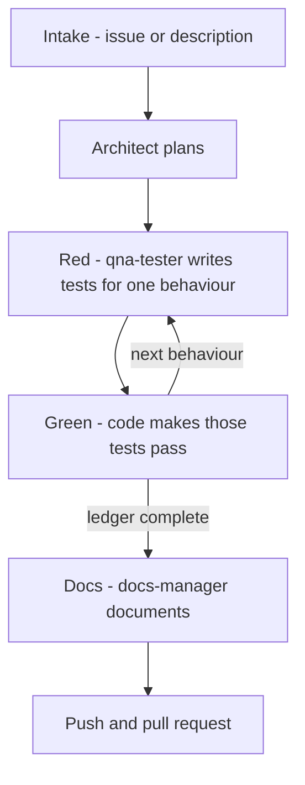

# How the Agents Work

`setup-repo` installs a team of agent modes that take a task — a GitHub issue or a
direct description — from intake to pull request under test-driven development. One
mode (the **tdd-manager**) runs the whole pipeline; the others are specialists it
delegates to, one behaviour at a time. This page explains how the pipeline is
shaped and why; installation steps live in the [VS Code plugin setup guide](2-setting-up-vscode-plugin.md).

## The flow

The same stages, in the same order, as the one-line flow in the README.

## Small context by design

The tdd-manager delegates **one behaviour at a time** to a **fresh** specialist
mode. A subtask has no memory of the conversation that came before — it receives
a self-contained message (goal, plan path, branch, test command) and reports back
— so no single agent accumulates a task's worth of context.

The durable state is the plan file, `plans/{task-slug}.md`. The architect's
numbered behaviour list is the loop's **ledger**, and the ledger lives in that
file rather than in the conversation because a context reset must not lose it:
the ledger may grow (a behaviour the plan missed is appended), but it may not be
silently trimmed. A subtask that finishes, fails, or loses its context can always
re-read the plan and know exactly what remains.

## The agents

Only the **tdd-manager creates subtasks**. Every specialist reports back and
stops; it never dispatches onward, so every handoff passes through the manager
and the ledger stays accurate.

### tdd-manager

- **Owns:** intake (an issue or a direct description must exist before work
  begins), the branch, delegation, the red/green loop, and all of git. It is the
  **sole git actor**: it creates the branch, commits after each red and each
  green, pushes, and opens the pull request.
- **May edit:** the plan file's ledger — plan files only.
- **Must not do:** write production code, tests or documentation itself; let a
  subtask commit; accept a red step that is not a genuine assertion failure.

### architect

- **Owns:** the plan at `plans/{task-slug}.md` — a numbered list of
  independently testable behaviours, each with inputs, outputs, edge cases and
  error behaviour, with every third-party fact cited.
- **May edit:** the plan file.
- **Must not do:** plan against an unknown third-party interface (it is a
  **blocking** condition — see [Grounded planning](#grounded-planning)); write
  the plan before validating with the user every newly defined behaviour and any
  non-standard package choice.

### qna-tester

- **Owns:** the red step — tests that fail now, for the right reason, for exactly
  one behaviour.
- **May edit:** test files, fixtures and the test runner.
- **Must not do:** touch production code; weaken a test to make it pass; create
  tasks for the coder or the documenter — it reports back and stops.

### code

- **Owns:** the green step — making exactly the failing tests pass, adding
  nothing the tests do not demand.
- **May edit:** source files.
- **Must not do:** change a test file. If it believes a test is wrong, it
  escalates — it reports the argument, never edits the test.

### docs-manager

- **Owns:** documentation, after the tests pass — code comments, usage guides,
  the README, kept in step with what the code actually does.
- **May edit:** documentation files, and source files for comment edits only.
- **Must not do:** change code behaviour; start before asking whether to
  document the current commit or the current branch.

## The red/green loop

A valid **red** is an **assertion** failure: the test ran and the behaviour it
expresses does not hold yet. An import, collection or syntax error is *not* a
red step — the behaviour was never actually expressed as a test — so the
tdd-manager re-delegates to qna-tester with the verbatim output and commits
nothing.

**Green** is verified by running the **full** suite, not only the new tests. A
test is **never weakened** to reach green. Each red and each green gets its own
commit, and a red is **never squashed** into its green: the commit history alone
then proves every test failed before it passed, which is the whole point of the
discipline. Nothing is committed on any failure path, so the history contains
only an intentional red or a verified green.

If the coder claims a test is wrong, the claim is not granted: it goes back to
qna-tester as a **new red step** carrying the coder's argument, and the qna-tester
decides. If the test changes, that change is itself a red step with its own
commit.

## Grounded planning

The architect plans against two MCP servers so the plan never rests on a guess.

**Oxylabs** (documentation fetching). An unknown third-party interface is a
**blocking** condition — "plausible" is not "known", and recalling a library's
shape from training is not knowing it. The architect fetches the reference pages
that answer the question with the Oxylabs server, saves each one in full under
`doc/external/{vendor}/{page-slug}.md` with the source URL at the top, records
adjacent-but-not-needed pages as one-line links in
[`doc/external/index.md`](external/index.md), and cites the saved file or URL
everywhere a third-party fact is asserted. `doc/external/` is committed, so the
research is reviewable in the pull request and is not re-fetched by every
developer.

The failure this prevents: a plan's guessed method signature does not stay a
guess — qna-tester writes tests against it, code makes those tests pass against
a shim, and the tests pass while the real integration still fails.

**package-registry** (dependency checking). Before a behaviour is specified as
bespoke code, the architect checks the package registries (npm, PyPI, crates.io,
NuGet, Go) plus GitHub security advisories: does a well-maintained package
already solve the problem? Names, versions and security advisories are verified
before any dependency enters the plan, and a package carrying an unpatched
critical advisory is not a safe reuse.

Credential handling for Oxylabs (signup, prompts, what a declined setup writes)
stays in the [VS Code plugin setup guide](2-setting-up-vscode-plugin.md).

## GitHub as the communication channel

Intake is a GitHub issue or a direct description, and the **intake medium fixes
the reply channel for the whole task**: a question about an issue-sourced task is
a comment on that issue, not a chat message. The reason is that a decision made
in chat is invisible to everyone reading the issue.

Five chat commands are installed with the agent modes:

* `/write-github-task` — turn a task description into a structured GitHub task issue.
* `/execute-github-task` — pull a GitHub issue, plan the approach collaboratively, then execute it.
* `/github-bug-report` — gather reproduction details and publish a structured bug report issue.
* `/create-pull-request` — open the pull request with a description generated from the branch changes.
* `/update_roo_rules` — compare the repo's `roo_template` against `.roo/` and add any rules or commands that are missing.

All four MCP servers (github, git, oxylabs, package-registry) are configured in
`.roo/mcp.json`; `github` needs a personal access token, and `oxylabs` is written
disabled when its credentials are declined — see
[VS Code plugin setup guide](2-setting-up-vscode-plugin.md) for both.

## What lands in your repo

`setup-repo` installs: the agent modes in `.roomodes`, the per-mode rules under
`.roo/`, the four MCP servers in `.roo/mcp.json`, the chat commands under
`.roo/commands/`, the devcontainer, and `.gitignore` protection for sensitive
files. Re-running `setup-repo` upgrades a provisioned repo by **merging** rather
than overwriting; the per-file merge semantics are documented in the
[VS Code plugin setup guide](2-setting-up-vscode-plugin.md).
