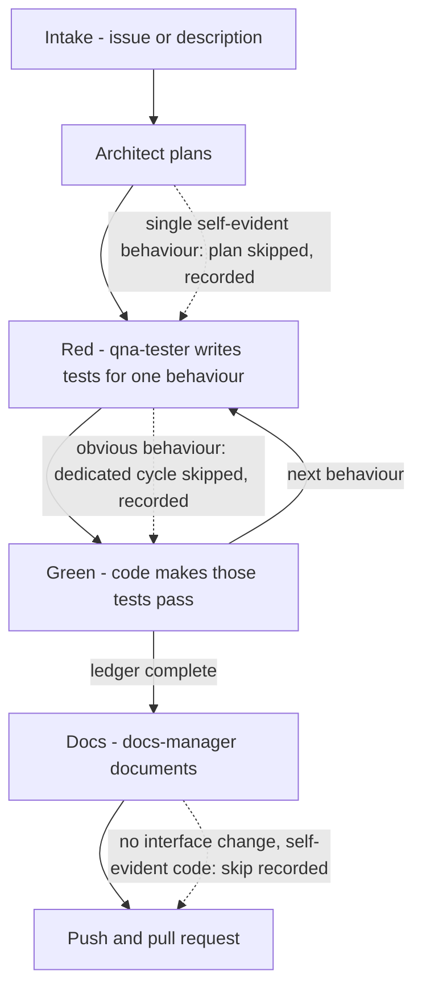

# How the Agents Work

`setup-repo` installs a team of agent modes that take a task — a GitHub issue or a
direct description — from intake to pull request under test-driven development. One
mode (the **tdd-manager**) runs the whole pipeline; the others are specialists it
delegates to, one behaviour at a time. This page explains how the pipeline is
shaped and why; installation steps live in the [VS Code plugin setup guide](2-setting-up-vscode-plugin.md).

## The flow

The solid edges are the main path; the dotted edges are the skips, detailed in
[Skipping a step](#skipping-a-step). The same stages, in the same order, as the
one-line flow in the README.

## Small context by design

The tdd-manager delegates **one behaviour at a time** to a **fresh** specialist
mode. A subtask has no memory of the conversation that came before — it receives
a self-contained message (goal, plan path, branch, test command) and reports back
— so no single agent accumulates a task's worth of context. The delegation is
brief on purpose: the behaviour, the failure and the constraints, with rationale
pointing at the plan rather than restating it. One deliberate exception to the
one-behaviour rule: behaviours that are pure boundary pins on existing behaviour
and need no production change may be batched into a single subtask; the
architect marks which ones those are in the plan, and the manager still commits
them separately if the ledger needs it.

The durable state is the plan file, `plans/{task-slug}.md`. The architect's
numbered behaviour list is the loop's **ledger**, and the ledger lives in that
file rather than in the conversation because a context reset must not lose it:
the ledger may grow (a behaviour the plan missed is appended), but it may not be
silently trimmed. A subtask that finishes, fails, or loses its context can always
re-read the plan and know exactly what remains.

## The agents

Only the **tdd-manager creates subtasks**. Every specialist reports back and
stops; it never dispatches onward, so every handoff passes through the manager
and the ledger stays accurate.

### tdd-manager

- **Owns:** intake (an issue or a direct description must exist before work
  begins), the branch, delegation, the red/green loop, the judgement of which
  steps are worth running, and all of git. It is the **sole git actor**: it
  creates the branch, commits after each red and each green, pushes, and opens
  the pull request.
- **May edit:** the plan file's ledger — plan files only.
- **Must not do:** write production code, tests or documentation itself; let a
  subtask commit; accept a red step that is not a genuine assertion failure.

### architect

- **Owns:** the plan at `plans/{task-slug}.md` — a numbered list of
  independently testable behaviours, each with inputs, outputs, edge cases and
  error behaviour, with every third-party fact cited. The plan also marks which
  behaviours are pure boundary pins with no production change, so the manager
  can batch them into one subtask, and which have no non-obvious input, output,
  edge or error, so their dedicated test cycle may be skipped.
- **May edit:** the plan file.
- **Must not do:** plan against an unknown third-party interface (it is a
  **blocking** condition — see [Grounded planning](#grounded-planning)); write
  the plan before validating with the user every newly defined behaviour and any
  non-standard package choice.

### qna-tester

- **Owns:** the red step — tests that fail now, for the right reason, for exactly
  one behaviour.
- **May edit:** test files, fixtures and the test runner.
- **Must not do:** touch production code; weaken a test to make it pass; create
  tasks for the coder or the documenter — it reports back and stops.

### code

- **Owns:** the green step — making exactly the failing tests pass, adding
  nothing the tests do not demand.
- **May edit:** source files.
- **Must not do:** change a test file. If it believes a test is wrong, it
  escalates — it reports the argument, never edits the test.

### docs-manager

- **Owns:** documentation, after the tests pass — code comments, usage guides,
  the README, kept in step with what the code actually does.
- **May edit:** documentation files, and source files for comment edits only.
- **Must not do:** change code behaviour; start before asking whether to
  document the current commit or the current branch.

## The red/green loop

A valid **red** is an **assertion** failure: the test ran and the behaviour it
expresses does not hold yet. An import, collection or syntax error is *not* a
red step — the behaviour was never actually expressed as a test — so the
tdd-manager re-delegates to qna-tester with the verbatim output and commits
nothing.

**Green** is committed when the **targeted** tests are green: while iterating
inside the red/green loop, only the targeted test file is run. The **full
suite** is the gate before the pull request, and it is also run whenever a
change could affect other modules — the tdd-manager runs it itself, verifies it
green, and the branch must pass it at the tip before shipping. That is a
deliberate trade: a regression outside the targeted file can now land in a
commit and sit in the history until the end-of-branch run, instead of blocking
the commit that caused it; the branch cannot ship with it, and bisecting still
finds it. The argument is in
[`plans/cut-agent-context-cost.md`](../plans/cut-agent-context-cost.md) §B10.
A test is **never weakened** to reach green. Each red and each green
gets its own commit, and a red is **never squashed** into its green: the commit
history alone then proves every test failed before it passed, which is the
whole point of the discipline. The one exception is a skip recorded in the
ledger (see [Skipping a step](#skipping-a-step)): a behaviour whose dedicated
cycle is skipped has no red and no green to commit, and the record of that skip
stands in place of the pair. On any failure path nothing is committed, so the
history contains only an intentional red, a verified green, or the record of a
justified skip.

Sequencing follows the same logic: a behaviour that invalidates an existing
test may not be planned **before** the cycle that rewrites that test — such a
step could turn green on paper and still be uncommittable, so the plan orders
the rewrite cycle first.

If the coder claims a test is wrong, the claim is not granted: it goes back to
qna-tester as a **new red step** carrying the coder's argument, and the qna-tester
decides. If the test changes, that change is itself a red step with its own
commit.

## Skipping a step

The pipeline is not a ritual: a step whose cost exceeds its value may be
skipped on judgement, and that judgement belongs to the tdd-manager, which alone
decides what gets delegated. The bound is a fail-safe, not a threshold — when in
doubt, the full step runs, and there is no line count, file count or behaviour
count that triggers a skip; the rules give examples (a string change, a rename)
rather than numbers. And a skip is never silent: the decision and its reason are
recorded in the ledger, which is what keeps it auditable in the pull request.

Three sites instantiate the general rule. For a **single self-evident
behaviour**, the full plan is skipped, but the numbered behaviour list still
exists — inline in the ledger — and the architect's blocking validation gate
still applies whenever a plan *is* written. For an **obvious behaviour** — no
non-obvious input, output, edge or error — the dedicated red/green cycle is
skipped; the module's existing targeted tests still run, and the full-suite gate
before the pull request and the manager's own verification of red and green are
unchanged. And the **docs-manager** subtask is skipped when no user-facing
interface changed and the code is self-evident — documentation exists to help
developers where the code lacks clarity, or users at an interface. What the
skips must not reach: the branch still has to pass the full suite at the tip,
and a cycle that *runs* still gets its own verified red and green.

## Grounded planning

The architect plans against two MCP servers so the plan never rests on a guess.

**Oxylabs** (documentation fetching). An unknown third-party interface is a
**blocking** condition — "plausible" is not "known", and recalling a library's
shape from training is not knowing it. The architect fetches the reference pages
that answer the question with the Oxylabs server, saves each one in full under
`doc/external/{vendor}/{page-slug}.md` with the source URL at the top, records
adjacent-but-not-needed pages as one-line links in
[`doc/external/index.md`](external/index.md), and cites the saved file or URL
everywhere a third-party fact is asserted. `doc/external/` is committed, so the
research is reviewable in the pull request and is not re-fetched by every
developer.

The failure this prevents: a plan's guessed method signature does not stay a
guess — qna-tester writes tests against it, code makes those tests pass against
a shim, and the tests pass while the real integration still fails.

**package-registry** (dependency checking). Before a behaviour is specified as
bespoke code, the architect checks the package registries (npm, PyPI, crates.io,
NuGet, Go) plus GitHub security advisories: does a well-maintained package
already solve the problem? Names, versions and security advisories are verified
before any dependency enters the plan, and a package carrying an unpatched
critical advisory is not a safe reuse.

Credential handling for Oxylabs (signup, prompts, what a declined setup writes)
stays in the [VS Code plugin setup guide](2-setting-up-vscode-plugin.md).

## GitHub as the communication channel

Intake is a GitHub issue or a direct description, and the **intake medium fixes
the reply channel for the whole task**: a question about an issue-sourced task is
a comment on that issue, not a chat message. The reason is that a decision made
in chat is invisible to everyone reading the issue.

Five of the chat commands are installed with the agent modes; the sixth,
`/harvest-roo-templates`, lives only in anvil's own `.roo/commands/` (tracked
through a `.gitignore` negation) and is never provisioned into a target repo:

* `/write-github-task` — turn a task description into a structured GitHub task issue.
* `/execute-github-task` — pull a GitHub issue, plan the approach collaboratively, then execute it.
* `/github-bug-report` — gather reproduction details and publish a structured bug report issue.
* `/create-pull-request` — open the pull request with a description generated from the branch changes.
* `/update_roo_rules` — compare the repo's `roo_template` against `.roo/` and add any rules or commands that are missing.
* `/harvest-roo-templates` *(anvil-only)* — the reverse of `/update_roo_rules`: read another repository's `.roo/` and `.roomodes`, report what `templates/roo_template/` lacks, and — after your confirmation — file a single GitHub issue tracking the shortlist.

All four MCP servers (github, git, oxylabs, package-registry) are configured in
`.roo/mcp.json`; `github` needs a personal access token, and `oxylabs` is written
disabled when its credentials are declined — see
[VS Code plugin setup guide](2-setting-up-vscode-plugin.md) for both.

## Where the rules live

Every subtask loads its rules from `.roo/` in two layers:

- **Shared, always-on** — `.roo/rules/` (`AGENTS.md`, `architecture.md`,
  `coding-guidelines.md`), loaded by every mode on every subtask. It is the
  most expensive context in the pipeline, so it holds only what every mode
  genuinely needs: the code-change process, MCP call hygiene, the KISS rules,
  the communication style, and the cross-cutting language and safety rules.
- **Per-mode** — `.roo/rules-{slug}/`, loaded only by that mode. Mode-specific
  guidance belongs here, not in the shared files: the test-writing
  conventions live in `rules-qna-tester/`, the documentation conventions and
  the documentation-finalisation rules in `rules-docs-manager/`, and the
  module-by-module project structure table in
  `rules-architect/project-structure.md` — loaded only by the architect, the
  only mode that needs it.

The tdd-manager's rule file is additionally capped: it stays at or below a
12,288 B byte ceiling asserted by
[`tests/test_manager_rules.py`](../tests/test_manager_rules.py). A byte-count
assertion normally violates the "never assert on the source text" convention;
here size *is* the requirement — the defect is that the file is too large and
every tdd-manager subtask pays for it — so the ceiling bounds the size while
the phrase predicates in the same tests bound the loss. The full argument is
in [`plans/cut-agent-context-cost.md`](../plans/cut-agent-context-cost.md) §6.

### The two copies, and the one place they diverge

Anvil provisions rule files from `templates/roo_template/` (tracked) into a
target's `.roo/` (gitignored). In this repo's own tree the two sides march
together: the four XML rule files are asserted **byte-identical** by
[`tests/test_rules_mirror.py`](../tests/test_rules_mirror.py), the guard that
turns "forgot the `.roo/` copy" into a red test instead of silent drift.

The one deliberate exception is the shared markdown pair,
`rules/architecture.md` and `rules/coding-guidelines.md`. When the
mode-specific content left the local shared files, it left the local copies
only: the template side is a placeholder scaffold, filled in per repo by
`/update_roo_rules`, so there was nothing to move. Instead the template's
`coding-guidelines.md` carries a one-line note telling the filling-in agent to
put mode-specific guidance in that mode's `rules-{slug}/` directory.

The measured effect: the shared `.roo/rules/` fell from 12,679 B to 9,818 B,
and per-subtask load dropped 35% for tdd-manager, 12% for docs-manager, 7% for
qna-tester and 2% for architect.

## What lands in your repo

`setup-repo` installs: the agent modes in `.roomodes`, the per-mode rules under
`.roo/`, the four MCP servers in `.roo/mcp.json`, the five provisioned chat
commands under `.roo/commands/` — the anvil-only `/harvest-roo-templates` never
crosses to a target — the devcontainer, and `.gitignore` protection for
sensitive
files. Re-running `setup-repo` upgrades a provisioned repo by **merging** rather
than overwriting; the per-file merge semantics are documented in the
[VS Code plugin setup guide](2-setting-up-vscode-plugin.md).
