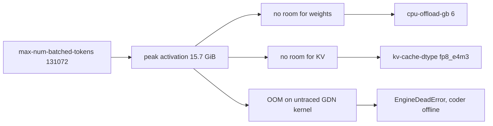

# Fixing the coder OOM and retuning the vLLM launch arguments

## Status

Diagnosis complete, awaiting decisions on four trade-offs before implementation.

## Symptom

The coder model (`Qwen/Qwen3.6-35B-A3B-FP8`) starts successfully, serves two
requests, then dies on the third:

```
torch.OutOfMemoryError: CUDA out of memory. Tried to allocate 216.00 MiB.
GPU 1 has a total capacity of 39.50 GiB of which 57.38 MiB is free.
```

Everything after that line in the log is fallout, not a second bug:

- `KeyError: 'chatcmpl-be332152412a55fb-83495c03'` — the scheduler asks for the
  output of the request whose worker just died. Async scheduling means the
  failure surfaces one step late, in `update_from_output`, which is why the
  traceback does not point at the real cause.
- `EngineDeadError` — the engine core has shut down. **It does not recover.**
  The container serves errors until it is restarted, so a single OOM takes the
  coder offline for the rest of the session.

## Root cause: the activation budget, not the model

vLLM's own accounting from the log, per GPU (39.50 GiB total, 37.93 GiB free at
startup):

| Item | Size | Note |
| --- | --- | --- |
| Weights | 11.59 GiB | after `--cpu-offload-gb 6` moved 6.16 GiB off-GPU |
| **Peak activation** | **15.70 GiB** | **the problem** |
| KV cache | 8.00 GiB | 1,412,447 tokens, 5.39x concurrency |
| CUDA graphs | 0.10 GiB | |
| Non-torch | 0.09 GiB | |
| **Total** | **~35.5 GiB** | against a 0.90 utilisation ceiling of 35.55 GiB |

The configuration fits *exactly*, with roughly 2 GiB of true headroom on a card
that has already lost 1.57 GiB to another process. Peak activation of 15.7 GiB is
driven by one flag:

```
--max-num-batched-tokens 131072
```

That is the chunked-prefill chunk size. Every transient activation buffer in the
forward pass is sized against it. 131072 is not a throughput setting, it is an
order of magnitude past useful — and it is paired with `--max-num-seqs 1`, so
there is no batch to fill it.

Profiling measured 15.7 GiB during warmup. Real inference then exceeded it,
because the profile run did not cover the Qwen3.6 hybrid-attention path that
actually allocated:

```
qwen_gdn_linear_attn.py:1285  mixed_qkv_non_spec = causal_conv1d_fn(...)
causal_conv1d.py:545          out = torch.empty_like(x)   <-- 216 MiB, denied
```

The 216 MiB figure is a red herring. Any allocation would have failed; this one
happened to be next. The JIT-compilation warnings immediately before the crash
(`_causal_conv1d_fwd_kernel`, `fused_sigmoid_gating_delta_rule_update_kernel`,
`eagle_prepare_inputs_padded_kernel`) confirm these kernels were reached for the
first time *after* warmup, so their buffers were never in the profile.

Shrinking `--max-num-batched-tokens` fixes the OOM and frees enough memory to
also remove two workarounds that were only there to pay for it.

## Secondary findings

### 1. `--cpu-offload-gb 6` is a self-inflicted wound

The log shows `Offloader set to UVAOffloader` and `Total CPU offloaded
parameters: 6.16`. UVA offload pages weights over PCIe on **every forward pass**,
not just at load. It costs latency permanently. It exists here only because the
activation budget left no room for the weights. Once activation drops, the full
~17.75 GiB of weights fits on-GPU with room to spare, and this flag should go.

### 2. `--kv-cache-dtype fp8_e4m3` buys nothing here and costs accuracy

Two warnings, both load-bearing:

```
Your GPU does not have native support for FP8 computation ... Weight-only FP8
compression will be used leveraging the Marlin kernel.
Checkpoint does not provide a q scaling factor. Setting it to k_scale.
Using KV cache scaling factor 1.0 for fp8_e4m3.
```

These are A100s (`arch=sm80`). There is no FP8 tensor core, so FP8 KV cache is a
pure memory trade, not a speed one. And the checkpoint ships no KV scaling
factors, so vLLM defaults to 1.0 — quantising the KV cache with an unfitted
scale, which is exactly the "accuracy drop without a proper scaling factor" the
log warns about.

The memory it saves is not needed. Measured from the log, KV costs ~5.9 KiB per
token in FP8, so ~11.9 KiB in BF16. A full 262144-token context needs ~3.1 GiB
in BF16 — trivial against the ~16 GiB that will be free.

### 3. MTP speculative decoding blocks full CUDA graphs

```
CUDAGraphMode.FULL_AND_PIECEWISE is not supported with spec-decode for
attention backend FlashInferBackend; setting cudagraph_mode=PIECEWISE
```

`--speculative-config '{"method":"qwen3_next_mtp",...}'` is also deprecated in
favour of `"mtp"` (`method 'qwen3_next_mtp' is deprecated and replaced with
mtp`). MTP is a real latency win for single-stream interactive coding, so this is
a genuine trade-off rather than a defect. See decision 3.

### 4. `HF_TOKEN` never reaches the model containers — a real bug

```
Warning: You are sending unauthenticated requests to the HF Hub.
```

[`docker-compose.yml`](../docker-compose.yml:26) passes `HF_TOKEN` into
llama-swap, but none of the three `cmd:` blocks in [`config.yaml`](../config.yaml)
forward it to the `docker run` they spawn. The gateway has the token; the
containers that actually download weights do not. Fix: add
`-e HF_TOKEN=${env.HF_TOKEN}` to each model command.

### 5. 1.57 GiB was already occupied on both coder GPUs at startup

```
Free memory on device (37.93/39.5 GiB) on startup.
```

Something else held ~1.6 GiB on *both* GPUs before the coder loaded. Candidates:
the generic model at `--gpu-memory-utilization 0.95`, or the nomic embedder at
`0.25`, landing on a device that overlaps `LLM_DEVICE_ID_1` / `LLM_DEVICE_ID_2`.
If the device ids overlap, no amount of retuning is stable — the neighbour's
footprint moves under us. See question 1.

### 6. Smaller items

- `--gpu-memory-utilization 0.90` is fragile when a neighbour shares the card,
  because the fraction is of *total* memory, not free memory. vLLM suggests
  `--kv-cache-memory` for an absolute, predictable budget.
- `--disable-custom-all-reduce` forces PYNCCL for TP=2. On NVLinked A100s the
  custom kernel is usually faster; worth measuring once the config is stable.
- `--mamba-cache-mode align` with prefix caching is flagged experimental for this
  architecture. Keep for now, but it is the first thing to disable if odd
  behaviour outlives the memory fix.
- `PYTORCH_CUDA_ALLOC_CONF=expandable_segments:True` is already set on the coder.
  Correct — keep it.

## Proposed memory budget after retuning

Per GPU, with `--max-num-batched-tokens 16384`, no CPU offload, BF16 KV cache:

| Item | Before | After |
| --- | --- | --- |
| Weights | 11.59 GiB | ~17.75 GiB (all on GPU) |
| Peak activation | 15.70 GiB | ~2–3 GiB |
| KV cache | 8.00 GiB (FP8) | ~12 GiB (BF16), >262144 tokens |
| Headroom | ~2 GiB | ~4 GiB |

Faster (no PCIe paging, no Marlin KV dequant), more accurate (no unfitted FP8
scale), and no longer balanced on a knife edge.



Reduce the first box and the whole chain dissolves.

## Decisions needed

### 1. GPU topology

Which physical devices are `LLM_DEVICE_ID_1` and `LLM_DEVICE_ID_2`, and does
`INDEXER_STORAGE_DEVICE_ID` or `LLM_DEVICE_ID_0` overlap either of them? This
explains the missing 1.57 GiB and determines whether an absolute
`--kv-cache-memory` is safe.

### 2. Context window: keep 262144?

Keeping it costs nothing in the new budget and **touches no tests**. Reducing it
means deliberately editing golden fixtures:
[`golden_config.yaml`](../tests/fixtures/golden_config.yaml:66),
[`golden_zoo_settings_local.json`](../tests/fixtures/golden_zoo_settings_local.json:15),
[`golden_zoo_settings_anthropic.json`](../tests/fixtures/golden_zoo_settings_anthropic.json:15),
[`fixtures/README.md`](../tests/fixtures/README.md:22),
[`test_provision.py`](../tests/test_provision.py:43),
[`test_render.py`](../tests/test_render.py:33), and
`DEFAULT_CONTEXT_WINDOW` in [`config.py`](../anvilkit/config.py:23) — the
fixtures README forbids regenerating them silently. Recommendation: **keep
262144**.

### 3. Keep MTP speculative decoding?

- **Keep** (recommended for interactive use): faster single-stream decode, but
  CUDA graphs stay PIECEWISE and the draft head costs memory. Update the
  deprecated method name to `"mtp"`.
- **Drop**: frees memory, enables `FULL_AND_PIECEWISE` graphs, slower per token.

### 4. Keep the FP8 KV cache?

Recommendation: **drop it** for `auto`. On sm80 it is memory-only, the memory is
no longer scarce, and the missing scale factors make it an accuracy liability.

## Implementation steps once decided

Ordered. Only [`config.yaml`](../config.yaml) changes unless decision 2 says
otherwise.

1. Confirm GPU device mapping and that the coder GPUs are exclusive.
2. Edit the coder block in [`config.yaml`](../config.yaml:51):
   `--max-num-batched-tokens 131072` → `16384`; remove `--cpu-offload-gb 6`;
   `--kv-cache-dtype fp8_e4m3` → `auto`; `"qwen3_next_mtp"` → `"mtp"`.
3. Add `-e HF_TOKEN=${env.HF_TOKEN}` to all three model `cmd:` blocks.
4. Restart and read the new `gpu_worker.py` budget lines. Set an explicit
   `--kv-cache-memory` from the reported figure, leaving deliberate headroom.
5. Exercise the failure path specifically: a long-context request followed by
   several short ones, since the crash needed a third request to reach the
   untraced GDN kernels.
6. Re-run `./tests/run` to confirm nothing regressed. Expected to pass untouched
   if decision 2 keeps 262144.
7. Update [`golden_config.yaml`](../tests/fixtures/golden_config.yaml) in its own
   commit, stating why, per the fixtures README.
8. Correct the hardware guidance in
   [`doc/1-setting-up-backend.md`](../doc/1-setting-up-backend.md:34): 2×24 GB is
   not sufficient for this model at 262144 context without offload, and the
   "64 GB RAM ... with speculative decoding" note no longer reflects a config
   that does not offload to host memory.

## Deliberately not doing

- Raising `--gpu-memory-utilization`. vLLM's suggestion to go to 0.9041 addresses
  CUDA-graph accounting, not a 15.7 GiB activation peak. It would buy ~200 MiB
  and delay the same crash.
- Setting `PYTORCH_CUDA_ALLOC_CONF=expandable_segments:True`. Already set. The
  error message recommends it generically; fragmentation is not the cause when
  only 57 MiB is free.
- Touching [`anvilkit/`](../anvilkit). Nothing in the Python is wrong.
  `config.yaml` is owned by llama-swap and read-only to Anvil, so this is a
  configuration change, and Anvil will pick up the new context window
  automatically if decision 2 changes it.
