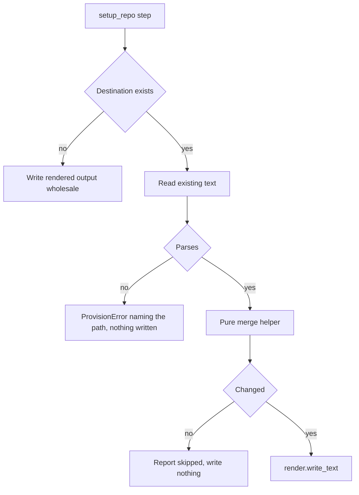

# Package-registry context + re-provisioning safety

Intake: GitHub issue [iar3-r8/Anvil#15](https://github.com/iar3-r8/Anvil/issues/15) —
"Limit the 'reinvent the wheel' issue by providing other packages context", plus the
user directive of 2026-08-19: *"as always make sure that updating repos will be valid
in the cases the repo is already setup. If you see some current features that overwrite
anything in an existing repo fix them."*

Branch: **`feature/package-registry-context`** — feature (new capability: a new MCP
server, new architect rules, and merge semantics that did not exist before). Although
part of the work corrects destructive re-provisioning, the change as a whole adds
capability, and a single branch keeps the MCP server and the merge that protects it
together.

Test command: `./tests/run`

---

## 1. Problem statement

Two distinct defects, deliberately fixed together because the second is what makes the
first survive a second `setup-repo` run.

**Defect A — no prior-art context.** The architect designs a coded solution without ever
checking whether a maintained package already solves the problem, and it defines new
behaviours and picks dependencies without a blocking confirmation from the user.

**Defect B — re-provisioning overwrites user-owned files.** Three artifacts are written
wholesale on every run, so a repository that is already set up loses whatever the
developer added:

| Artifact | Written by | Today | Decided |
| --- | --- | --- | --- |
| `.roomodes` | [`_copy_root_roomodes()`](anvilkit/provision.py:443) | hard overwrite | merge by `slug` |
| `.roo/mcp.json` | [`_write_mcp_settings()`](anvilkit/provision.py:388) | full rewrite | merge by server name |
| `.vscode/extensions.json` | [`_write_extensions()`](anvilkit/provision.py:400) | full rewrite | merge `recommendations` |
| `zoo-code-settings.json` | [`_write_zoo_settings()`](anvilkit/provision.py:353) | full rewrite | **keep** (Anvil-managed, gitignored, carries resolved secrets) |
| `.roo/rules-*/` | [`_deploy_mode_rules()`](anvilkit/provision.py:458) | rmtree + copytree | **keep** (Anvil-authored rule sets, replaced as a unit) |
| `.devcontainer/` | [`_copy_devcontainer()`](anvilkit/provision.py:482) | skipped if present | already safe |
| `.gitignore` | [`_merge_gitignore_step()`](anvilkit/provision.py:289) | merged | already safe — the precedent this plan follows |

The "keep" rows are not oversights. They are locked by regression tests (behaviours 21
and 22) so a later change cannot silently flip them.

---

## 2. Design decisions

### 2.1 Merge helpers follow the `_merge_gitignore` precedent

Each merge is a **pure function in `anvilkit/provision.py`** taking strings and returning
a string (or `None` for "unchanged"), plus a thin provisioning step that does the file
I/O. That is exactly the shape of [`_merge_gitignore()`](anvilkit/provision.py:228) and
[`_merge_gitignore_step()`](anvilkit/provision.py:289), and it is why the gitignore merge
has fourteen unit tests that never touch a filesystem.

`render.py` keeps owning *generation*; the mergers reconcile generated output with what
is already on disk, which is filesystem work and therefore `provision.py`'s job.
`provision.py` still makes no decision that belongs to the user and never prompts.

Every helper takes an optional `source: str` argument used **only** in error messages, so
the pure function can name the offending file without ever touching a path.

```python
def _merge_mcp_servers(existing_text: str, rendered_text: str, source: str = "...") -> str
def _merge_roomodes(existing_text: str, template_text: str, source: str = "...") -> Optional[str]
def _merge_extensions(existing_text: str, rendered_text: str, source: str = "...") -> str
```

Python 3.8 spellings throughout: `Optional[str]`, `List[str]`, `Dict[str, Any]`. No
`match`, no `X | Y`, no `dict | dict`.

### 2.2 JSON merges are rebuilt with `json.dumps`, never spliced

`.roo/mcp.json` and `.vscode/extensions.json` are parsed into dicts, merged as data, and
re-emitted with `json.dumps(..., indent=4)` — the rule that removed
`escape_sed_replacement()`. Insertion order is preserved (CPython 3.7+ dicts), so an
existing server keeps its position and new Anvil servers are appended after it.

**Consequence to state plainly:** "preserved" means *value-preserved*, not
*byte-preserved*. A user's tab-indented `mcp.json` comes back indented with four spaces.
Tests therefore assert on parsed structures and on key order, never on raw bytes. This is
already the house rule for these files (`.roo/mcp.json` is gitignored, so the reformat
costs no diff noise).

### 2.3 `.roomodes` is merged by parsing YAML but appending **text**

`.roomodes` is YAML, and `yamlio` is deliberately load-only — Anvil has never written
YAML and adding `safe_dump` would be a new capability with a real cost: a round-trip
through PyYAML reflows block scalars (`>-`), drops comments, and reorders nothing but
rewrites everything. On a file the user is expected to hand-edit, that is destruction by
another name.

The merge therefore splits the two concerns:

- **Decide with the parser.** `yamlio.loads()` gives the set of slugs already present in
  the target. Parsing is required for correctness: the string `slug:` can legally appear
  inside a `roleDefinition` block scalar, so a textual scan would produce false positives.
- **Emit as text.** The template's own bytes for each missing mode block are appended
  verbatim. Nothing already in the user's file is re-serialised; it is preserved
  byte-for-byte as a prefix, exactly as `_merge_gitignore` does.

`provision.py` imports `yamlio` (as `config.py` already does) and translates `YamlError`
into `ProvisionError`, keeping one exception type per module.

Template block splitting: after the `customModes:` key, each sequence item begins with a
line matching `^(\s*)- slug:\s*(\S+)` and runs until the next line at that same
indentation beginning with `- `, or end of file. The indentation is taken from the first
item found rather than hard-coded, so a re-indented template does not break the split.

### 2.4 Ownership rule for `.roo/mcp.json` — confirmed

Adopted rule: **a server named in the freshly rendered output is Anvil-owned and is
refreshed; a server present only in the existing file is user-owned and is preserved
untouched. Nothing is ever removed.**

This diverges from answer 3 as initially worded on the issue ("preserve every existing
server entry untouched, append only servers not already present"). The divergence was
flagged as A1 and **confirmed as option 1 on 2026-08-19** (issue comment + user pick);
A2 was confirmed in the same exchange.

### 2.5 Flow



---

## 3. Behaviour ledger

Each numbered item is one red/green cycle. Inputs, outputs, edge cases and error
behaviour are stated for each. Items marked **(guard)** lock an existing decision and
should fail only if someone changes it later.

### Group A — the package-registry MCP server

**1. `templates/mcp.json.template` declares the `package-registry` server.**
- *Input:* the template file, read as data.
- *Output:* parsed JSON has `mcpServers["package-registry"]` equal to
  `{"command": "npx", "args": ["package-registry-mcp"], "disabled": false, "alwaysAllow": []}`.
- *Edge:* the entry has **no** `env` key — the server needs no credentials, so nothing
  must be substituted into it.
- *Edge:* `github`, `git` and `oxylabs` are still present and unchanged; the template is
  still valid JSON.
- *Error:* none — this is a data file.
- *Source for the launch config:* the package-registry-mcp README, as quoted in the
  intake. Tool surface it provides: `search-npm-packages`,
  `get-npm-package-details`, `list-npm-package-versions`, `search-cargo-packages`,
  `get-cargo-package-details`, `list-cargo-package-versions`, `search-nuget-packages`,
  `get-nuget-package-details`, `list-nuget-package-versions`, `get-pypi-package-details`,
  `list-pypi-package-versions`, `get-golang-package-details`,
  `list-golang-package-versions`, `search-github-advisories`, `get-github-advisory`,
  `get-package-advisories`.

**2. `render.mcp_settings()` emits the server, with the signature unchanged.**
- *Input:* `mcp_settings(workspace_folder, github_token)` called with two positional
  arguments (backward compatibility), and again with the oxylabs keyword arguments.
- *Output:* parsed result contains `package-registry` with `disabled` false and
  `args == ["package-registry-mcp"]`; `github`, `git`, `oxylabs` behave exactly as before;
  no `${` token survives anywhere in the rendered text.
- *Edge:* the renderer must not assume every server has an `env` key — the new entry has
  none, so any blanket iteration over `servers[...]["env"]` would raise `KeyError`.
- *Error:* unchanged. No new `RenderError` path; the entry is pass-through data.
- *Fixture:* `tests/fixtures/golden_mcp.json` gains the server in the same green step.
  This is a deliberate fixture change with a stated reason ("a new Anvil-owned MCP server
  was added"), which is the path `tests/fixtures/README.md` sanctions — not a
  regeneration to silence a failure.

### Group B — `.roo/mcp.json` merge

**3. `_merge_mcp_servers()` exists as a pure helper and is a no-op on a first run.**
- *Input:* `existing_text == ""`, `rendered_text` = any valid rendered JSON.
- *Output:* the rendered text, semantically identical to today's first-run output.
- *Edge:* whitespace-only existing text is treated as empty.

**4. A user-added server is preserved and keeps its position.**
- *Input:* existing file whose `mcpServers` contains `"my-server"` (not in the template)
  plus the Anvil servers; rendered text from the current template.
- *Output:* `my-server` is present with a parsed value equal to the input value, and it
  appears **before** any newly appended Anvil server in `list(mcpServers.keys())`.
- *Edge:* top-level keys other than `mcpServers` in the existing file are preserved.
- *Edge:* existing file has no `mcpServers` key → the key is created, other top-level keys
  survive.
- *Error:* existing `mcpServers` is not a mapping (a list, a string) → `ProvisionError`
  naming the source.

**5. An Anvil-owned server is refreshed.**
- *Input:* existing file whose `github` entry carries the token `ghp_old`; rendered text
  carrying `ghp_new`.
- *Output:* `github.env.GITHUB_PERSONAL_ACCESS_TOKEN == "ghp_new"`.
- *Edge:* an Anvil server missing from the existing file (a repo provisioned before
  `package-registry` existed) is appended.
- *Note:* this is the behaviour that keeps the documented "re-run `setup-repo` to pick up
  oxylabs credentials" flow working. See assumption A1.

**6. `setup_repo` wires the merge in, and reports what it did.**
- *Input:* a target repo, provisioned twice, the second time with a different GitHub token
  and a user-added server written in between.
- *Output:* both survive per behaviours 4 and 5; the echo line distinguishes created from
  merged; the existing dry-run tests still pass unchanged (nothing is written under
  `dry_run=True`).
- *Edge:* first run on a fresh repo produces output byte-identical to today's.

**7. A malformed existing `.roo/mcp.json` fails cleanly.**
- *Input:* existing file containing `not json at all`, and separately a file containing
  invalid UTF-8 bytes.
- *Output:* `ProvisionError` whose message names the path and the parse problem.
- *Edge:* the original bytes on disk are unchanged after the error.
- *Edge:* the error is raised under `dry_run=True` as well — a dry run must not hide a
  fault it would hit for real. This matches
  [`_merge_gitignore_step()`](anvilkit/provision.py:309), which validates before checking
  `dry_run`.
- *Error type:* `ProvisionError`, never a bare `json.JSONDecodeError` or
  `UnicodeDecodeError`. Exit code 5.

**8. An empty incoming credential does not blank a stored one. (confirmed — see A2)**
- *Input:* existing `oxylabs` entry with `OXYLABS_USERNAME == "stored_user"`; rendered
  text where that value is `""` and `disabled` is true.
- *Output:* the stored value survives. The `disabled` flag is **not** protected: it is
  refreshed with the Anvil-owned entry per A1 option 1 (only `env` values are protected).
- *Edge:* a *non-empty* incoming value always wins, including a deliberate change.
- *Rationale:* today a re-run after `.env` loses a credential silently disables the
  server. That is precisely the "overwrites something in an existing repo" class the user
  asked to fix.
- *Edge (added after green):* the original draft said "`disabled` stays false". Under A1
  option 1 the whole Anvil-owned entry except `env` values is refreshed, so with empty
  incoming credentials the stored credentials survive but the renderer's
  `disabled: true` (empty `.env` signal, see `render.mcp_settings`) also refreshes in.
  The tests lock this deliberately: an empty stored credential is indistinguishable from
  one that is being set, and the `disabled` flag follows the incoming entry.

### Group C — `.roomodes` merge

**9. `_merge_roomodes()` returns the template verbatim when there is nothing to merge.**
- *Input:* `existing_text == ""` (or whitespace only), template text.
- *Output:* the template text unchanged, byte-for-byte.

**10. Missing slugs are appended; present slugs are never touched.**
- *Input:* an existing `.roomodes` holding `docs-manager` with a user-edited
  `fileRegex`, and no `qna-tester`; the template holding all three modes.
- *Output:* the returned text **starts with** the existing text (user edit intact,
  byte-for-byte), and the appended region contains the template's `qna-tester` and
  `tdd-manager` blocks. `docs-manager` appears exactly once.
- *Edge:* every slug already present → returns `None`, meaning "unchanged", and the step
  writes nothing (the gitignore precedent).
- *Edge:* the existing file lacks a trailing newline → one is added before the appended
  block, so the first appended line is not glued to the last existing line.

**11. An appended block is the template's bytes verbatim.**
- *Input:* template block for `tdd-manager`, which contains a `>-` folded scalar and
  nested `groups` entries.
- *Output:* that exact substring of the template appears in the merged result — proving
  no YAML round-trip reflowed it.
- *Edge:* block boundaries are derived from the indentation of the first sequence item,
  not hard-coded to two spaces.
- *Edge:* the last block in the template (terminated by EOF rather than by the next
  `- slug:`) is extracted completely.

**12. Structural edge cases in the existing file.**
- *Input a:* existing file parses to a mapping with other keys but **no** `customModes`
  → a `customModes:` key is appended followed by every template block.
- *Input b:* existing `customModes:` is present but null/empty → all template blocks are
  appended under the existing key, and no second `customModes:` line is emitted.
- *Error:* existing file is not valid YAML, or its top level is not a mapping →
  `ProvisionError` naming the path; original bytes unchanged; raised under `dry_run` too.
- *Error:* the *template* has no `customModes` key, or a block with no parseable slug →
  `ProvisionError` reporting template drift, by analogy with the `${CONTEXT_WINDOW}` drift
  check in [`_load_zoo_template()`](anvilkit/render.py:135).

**13. `setup_repo` merges `.roomodes` instead of overwriting it.**
- *Input:* provision once, hand-edit the deployed `.roomodes`, provision again.
- *Output:* the hand edit survives; the file still contains every template slug.
- *Edge:* first run still deploys the template verbatim — the existing assertion
  `test_roomodes_content_matches_template` must keep passing untouched.
- *Edge:* `dry_run=True` writes nothing.

### Group D — `.vscode/extensions.json` merge

**14. `_merge_extensions()` merges `recommendations` and preserves the rest.**
- *Input:* existing file with `{"recommendations": ["ms-python.python"], "unwantedRecommendations": ["x"]}`,
  rendered text recommending `zoocodeorganization.zoo-code`.
- *Output:* `recommendations == ["ms-python.python", "zoocodeorganization.zoo-code"]`
  (existing first, appended after), and `unwantedRecommendations` is preserved.
- *Edge:* an entry already present is not duplicated.
- *Edge:* empty existing text → rendered output verbatim.
- *Edge:* existing file has no `recommendations` key → it is created.
- *Error:* invalid JSON, or `recommendations` not a list → `ProvisionError` naming the
  path; original bytes unchanged; raised under `dry_run` too.

**15. `setup_repo` merges `.vscode/extensions.json`.**
- *Input:* provision, add a recommendation by hand, provision again.
- *Output:* both recommendations present, exactly once each; first run output unchanged
  from today.

### Group E — architect and TDD-manager instructions

**16. The architect template gains a "check for an existing solution" step.**
- *Input:* `templates/roo_template/rules-architect/instructions.xml`, parsed with
  `xml.etree.ElementTree`.
- *Output:* a `<step>` exists whose `<title>` names searching for existing packages, and
  whose text names the `package-registry` MCP server and requires the check to happen
  **before** a coded solution is defined. Its `number` places it after "Understand the
  requirement" and before "Write the plan"; the remaining steps are renumbered
  contiguously with no duplicate or missing `number`.
- *Output:* a matching `<practice>` in `<best_practices>`, a `<pitfall>` whose `<mistake>`
  is writing a bespoke implementation of a solved problem, and a `<quality_checklist>`
  item.
- *Edge:* the document remains well-formed XML with root tag `instructions` — assert by
  parsing, not by substring.
- *Edge:* the existing oxylabs steps and their content are still present, so the new step
  is additive.
- *Error:* none — a data file.

**17. The architect template gains the blocking user-validation gate.**
- *Input:* the same file.
- *Output:* a `<step>` requiring the architect to validate with the user, during the
  planning session and **before the plan is written**, (a) every newly defined behaviour
  and (b) any proposed use of a non-standard package — "non-standard" being anything
  beyond the project's declared/standard dependencies. The text states it is blocking.
- *Output:* a corresponding `<practice priority="high">`, a `<pitfall>` for proceeding
  without confirmation, and a `<quality_checklist>` item under the planning category.
- *Edge:* well-formed XML, contiguous step numbering (shared with behaviour 16 — verify
  again after this edit).

**18. The architect instructions reach the target repo.**
- *Input:* a provisioned target.
- *Output:* `.roo/rules-architect/instructions.xml` exists, parses, and is byte-identical
  to the template — the existing `rules-*` loop needs no code change, and this test proves
  it.
- *Note:* the anvil repo's own `.roo/rules-architect/` holds an empty `rules.md` and no
  `instructions.xml`. Mirroring the template locally is proposed in A3.

**19. The TDD-manager template requires the validated plan.**
- *Input:* `templates/roo_template/rules-tdd-manager/instructions.xml`, parsed as XML.
- *Output:* the `<to_architect>` `<payload>` gains an `<item>` requiring the architect to
  validate new behaviours and any non-standard package with the user before writing the
  plan; `<required_report>` gains an `<item>` requiring that confirmation to be reported.
  Workflow step 3 ("Delegate planning to architect") states the same requirement.
- *Edge:* well-formed XML; the existing delegation contract items are untouched.

**20. The anvil repo's own TDD-manager rules carry the same requirement.**
- *Input:* `.roo/rules-tdd-manager/instructions.xml`.
- *Output:* it states the same validation requirement as the template. The test asserts
  the requirement is present in **both** files, so the local copy cannot drift on this
  point.
- *Rationale for not asserting whole-file equality:* the local copy may legitimately carry
  repo-specific text; only the shared requirement is locked.
- *Edge (added after green):* `.roo/*` is gitignored, so the local copy is absent on a
  fresh clone. The B20 tests must skip cleanly when the file is missing and keep the full
  assertion set when it is present.

### Group F — regression guards

**21. (guard) `zoo-code-settings.json` is still rewritten wholesale.**
- *Input:* provision, overwrite the file with `{"stale": true}`, provision again.
- *Output:* the stale key is gone and the resolved values are back. Locks the "no change"
  decision so a future merge cannot be added by accident.

**22. (guard) `.roo/rules-*/` is still replaced wholesale.**
- *Input:* provision, drop a stray `orphan.xml` into `.roo/rules-qna-tester/`, provision
  again.
- *Output:* `orphan.xml` is gone and `instructions.xml` matches the template. The existing
  `test_existing_mode_rules_are_overwritten` covers overwrite; this adds the removal half.

---

## 4. Files touched

| File | Change |
| --- | --- |
| `templates/mcp.json.template` | add `package-registry` server (B1) |
| `tests/fixtures/golden_mcp.json` | add the same server, deliberately (B2) |
| `anvilkit/render.py` | no signature change; verify no blanket `env` access (B2) |
| `anvilkit/provision.py` | three pure mergers + three rewired steps; import `yamlio` (B3–B15) |
| `templates/roo_template/rules-architect/instructions.xml` | new steps 16, 17 |
| `templates/roo_template/rules-tdd-manager/instructions.xml` | B19 |
| `.roo/rules-tdd-manager/instructions.xml` | B20 |
| `tests/test_render.py` | B2 |
| `tests/test_provision_mcp_merge.py` *(new)* | B3–B8 |
| `tests/test_provision_roomodes_merge.py` *(new)* | B9–B13 |
| `tests/test_provision_extensions_merge.py` *(new)* | B14–B15 |
| `tests/test_templates_rules.py` *(new)* | B16–B20 |
| `tests/test_provision.py` | B18, B21, B22 |

New test modules keep `test_provision.py` from growing unreadable, matching the existing
split that produced `test_provision_gitignore.py` and `test_provision_devcontainer.py`.

Constraints every cycle must respect: Python 3.8 syntax only; `typing` spellings on every
public signature; one exception type per module (`ProvisionError` from `provision`,
`RenderError` from `render`, `YamlError` translated at the boundary); structured output
built as a dict and emitted with `json.dumps`; no test touching the network, the Docker
daemon or `$HOME`; no assertion on the source text of the module under test — template
files are data and may be asserted on directly (precedent: PR #12).

---

## 5. Assumptions needing confirmation

**A1 — RESOLVED (2026-08-19, option 1): the `.roo/mcp.json` ownership rule (behaviour 5)
contradicted answer 3 as worded on the issue; the user confirmed option 1 above.**

Answer 3 as confirmed says: *preserve every existing server entry untouched, append only
servers not already present.* Taken literally, a second `setup-repo` run can never change
an existing server, which breaks a documented flow: `templates/update_roo_rules.md` tells
users to *"Re-run `./anvil setup-repo /path/to/this/repo` … and supply credentials when
prompted"* to pick up oxylabs. Under strict preservation that re-run silently does
nothing, and a rotated GitHub token can never be written.

This plan therefore specifies the refined rule of §2.4: refresh servers that appear in the
rendered template (Anvil-owned), preserve everything else (user-owned), remove nothing.
The cost is that a user's hand edit *to an Anvil-owned server* — say adding entries to
`github.alwaysAllow` — is still lost on the next run.

Three options, pick one before behaviour 5 is written:

1. **As planned (recommended).** Anvil servers refresh, user servers are untouched.
   Credential rotation keeps working.
2. **Strict answer 3.** Nothing existing is ever modified. Safest for hand edits, but
   `setup-repo` stops being able to update credentials, and `update_roo_rules.md` must be
   corrected to say so.
3. **Field-level merge.** Refresh only `command`, `args` and `env` on Anvil servers while
   preserving `disabled`, `alwaysAllow` and `disabledTools` when the existing file already
   sets them. Most faithful to both intents, most fiddly to specify and test.

**A2 — RESOLVED (2026-08-19, confirmed): behaviour 8 (an empty incoming credential must
not blank a stored one) stays in the ledger.**

It follows from the user's directive about not overwriting things in an existing repo, and
from the `oxylabs` `disabled` flag flipping to true whenever credentials are absent. But it
means a user who *deliberately* clears a credential cannot clear it through `setup-repo`;
they would edit `.roo/mcp.json` by hand. Confirm, or drop behaviour 8 and accept that an
unset credential disables the server on every re-run.

Behaviour 8 is only reachable under option 1 or 3 of A1. Under option 2 it is redundant and
should be struck from the ledger.

**A3 — the anvil repo's own `.roo/rules-architect/` does not mirror the template.**

It holds an empty `rules.md` and no `instructions.xml`, so the architect rules this plan
writes into the template will not apply to work done *in the anvil repo itself*. The intake
mandates mirroring only for the TDD-manager (behaviour 20). Options: leave as is (planned),
or add a behaviour writing the architect template to
`.roo/rules-architect/instructions.xml` so Anvil eats its own dog food.

**A4 — `.roomodes` merge granularity is per-mode, not per-field.**

A slug already present is skipped entirely. If the template later adds a field to a mode
the user already has, that field never arrives; the user re-runs `/update_roo_rules.md`,
which is exactly what that command exists for. This is the documented semantics in
`templates/update_roo_rules.md`, now being locked in code.

**A5 — merged JSON is re-serialised, so formatting is normalised.**

Stated in §2.2. If byte-preservation of a hand-formatted `.roo/mcp.json` matters, this plan
does not deliver it and the approach would have to change substantially.

**A6 — `package-registry-mcp` runs via `npx` and needs Node on the developer's machine.**

The template uses `npx` without `-y`, as the upstream README specifies, unlike the `github`
entry which passes `-y`. On a machine without Node the server simply fails to start; Anvil
does not probe for it, consistent with how the `uvx`-based servers are handled today. No
behaviour in this plan checks for Node.

---

## 6. Suggested cycle order

Groups A → B → C → D → E → F. Behaviours 1 and 2 change the rendered output every mcp-merge
test builds on, so they land first. Group B is the riskiest and gets attention while the
context is fresh. Group E is independent and can slot in anywhere. Group F lands last so
the guards lock the final state.

Blocking before group B starts: **A1** must be answered, and **A2** with it.