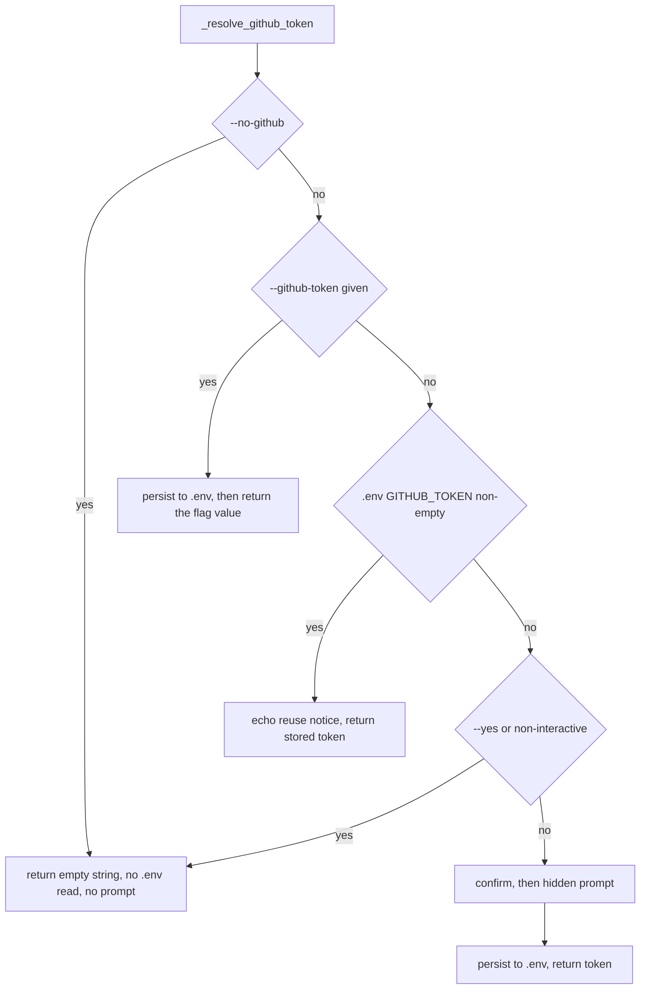

# Plan — skip the GitHub token prompt when a token is already stored

Intake: GitHub issue [iar3-r8/Anvil#18](https://github.com/iar3-r8/Anvil/issues/18).
Branch: `bugfix/skip-github-token-prompt` (a correction to existing behaviour, not a new capability).

## 1. Problem

`./anvil setup-repo <path>` re-enters the GitHub credential flow on every run. [`_resolve_github_token()`](../anvilkit/cli.py:752) honours only `--no-github` and `--github-token`, then falls through to [`prompts.confirm()`](../anvilkit/cli.py:762) unconditionally. There is no store to consult: the token has never been written to `.env`, it only ever lands in the target repo's `.roo/mcp.json` via [`render.mcp_settings()`](../anvilkit/render.py:97).

[`_resolve_oxylabs()`](../anvilkit/cli.py:786) already solves the same problem correctly — it reads `OXYLABS_USERNAME`/`OXYLABS_PASSWORD` from `.env` at [cli.py:800](../anvilkit/cli.py:800) and returns early when both are present.

Decision recorded from the planning session: the GitHub token uses the same `.env`-backed store as Oxylabs, not the target repo's `mcp.json`, so the decision is shared across every provisioned repository rather than per-target. The user's words: *"We should probably treat github the same as oxylabs and keep consistency in the repo (also for future case like this)."*

## 2. Existing-solution check

Searched the PyPI registry via the package-registry MCP server for an off-the-shelf `.env` store. The only credible candidate is **`python-dotenv`** (PyPI, latest 1.2.3). It is rejected on two independent grounds:

- Its published metadata declares `requires_python >=3.10`, which breaks Anvil's Python 3.8 floor that [`scripts/bootstrap.sh`](../scripts/bootstrap.sh) probes for. (Source: PyPI package metadata for `python-dotenv` 1.2.3, `requires_python` field, retrieved via package-registry MCP; the project changelog records "Drop support for Python 3.8" in the 1.1.0 release.)
- Versions `< 1.2.2` carry [GHSA-mf9w-mj56-hr94](https://github.com/advisories/GHSA-mf9w-mj56-hr94) / CVE-2026-28684 (medium, CVSS 6.6): `set_key()` follows symlinks via a cross-device rename fallback, allowing arbitrary file overwrite. A 3.8-compatible pin would sit inside the vulnerable range.

The repository already owns a purpose-built, tested store in [`anvilkit/env.py`](../anvilkit/env.py:1): [`env.get()`](../anvilkit/env.py:40) and [`env.set_value()`](../anvilkit/env.py:44), the latter documented to match the key exactly and preserve surrounding lines, comments and ordering.

**Outcome: no new dependency.** `requirements.txt` stays `pyyaml`, `typer`, `click`. Confirmed with the user before this plan was written.

## 3. Design

A new module constant beside [`ANTHROPIC_KEY_ENV`](../anvilkit/cli.py:75):

```python
GITHUB_TOKEN_ENV = "GITHUB_TOKEN"
```

The name matches the variable the existing decline message already tells users to populate ([cli.py:773](../anvilkit/cli.py:773)) and the placeholder in [`templates/mcp.json.template`](../templates/mcp.json.template) (`"GITHUB_PERSONAL_ACCESS_TOKEN": "${GITHUB_TOKEN}"`, asserted at [tests/test_mcp_template.py:41](../tests/test_mcp_template.py:41)).

Resolution order inside `_resolve_github_token`, mirroring `_resolve_oxylabs`:



A private helper `_persist_github_token(shared, token)` carries the dry-run guard and the no-op-if-unchanged rule, shaped exactly like [`_persist_anthropic_key()`](../anvilkit/cli.py:917).

Nothing downstream changes shape: [`setup_repo()`](../anvilkit/cli.py:981) still assigns the returned string to `RepoPlan.github_token`, which [`provision.setup_repo()`](../anvilkit/provision.py:794) passes to `render.mcp_settings()`.

## 4. Behaviours

Each is independently testable and is one red-green cycle. Tests belong in `tests/test_cli.py`, alongside `TestResolveOxylabs` ([tests/test_cli.py:1625](../tests/test_cli.py:1625)), whose fixtures (`CliCase`, `write_env`, `env_path`) already provide an isolated repo root under `tempfile` with `cli.REPO_ROOT` patched — so no test touches the network, the Docker daemon or `$HOME`.

### B1 — `--no-github` short-circuits before any store access

- Input: `no_github=True`, `.env` containing `GITHUB_TOKEN=ghp_stored`.
- Output: `""`.
- `env.get` is never called and `prompts.confirm` is never called. Patch both with `side_effect=AssertionError(...)`, matching the oxylabs precedent at [tests/test_cli.py:1652](../tests/test_cli.py:1652).
- Edge case: also holds when `.env` does not exist.

### B2 — `--github-token` wins over the store, and is persisted

- Input: `token="ghp_flag"`, `.env` containing `GITHUB_TOKEN=ghp_stored`.
- Output: `"ghp_flag"`. No prompt of any kind.
- Side effect: `.env` now holds `GITHUB_TOKEN=ghp_flag`, via the B9/B10 rules below.
- Rationale for the divergence from `_resolve_oxylabs` (which does not persist a flag value): confirmed by the user in the planning session. Following [`_persist_anthropic_key()`](../anvilkit/cli.py:903), which persists a flag-supplied key, means a user who always passes `--github-token` populates the store rather than being prompted forever on flag-less runs.
- Edge case: `--github-token ""` (explicit empty string) is `token is not None`, so it returns `""` and, being unchanged-or-empty, must not overwrite a non-empty stored value — assert the stored token survives.

### B3 — a stored token is reused, and the skip is reported

- Input: `token=None`, `no_github=False`, `.env` containing `GITHUB_TOKEN=ghp_stored`, interactive.
- Output: `"ghp_stored"`.
- `prompts.confirm` and `prompts.ask_required` are never called.
- Echoes a skip notice modelled on [cli.py:892](../anvilkit/cli.py:892): `🔑 Reusing existing GITHUB_TOKEN from .env`. The token value itself is never echoed — assert the secret does not appear in captured output.

### B4 — an empty stored value counts as absent

- Input: `.env` containing `GITHUB_TOKEN=` (empty), interactive, no flag.
- Output: falls through to the confirm/prompt path. This is the truthiness check `if stored:`, matching how `_resolve_oxylabs` treats a blank username at [cli.py:802](../anvilkit/cli.py:802).
- Edge case: `.env` absent entirely behaves identically ([`env.get()`](../anvilkit/env.py:40) returns the default for a missing file, guaranteed by [`env.read()`](../anvilkit/env.py:18)).

### B5 — `--yes` or non-interactive with nothing stored returns empty, never blocking

- Input: `assume_yes=True` (and separately, `interactive()` returning `False`), `.env` with no `GITHUB_TOKEN`.
- Output: `""`, with `prompts.confirm` patched to raise if called.
- This makes explicit a guard that today is only an emergent property of `confirm(default=False)`; the Definition of Done requires no new blocking prompt.

### B6 — `--yes` or non-interactive with a stored token returns the stored token

- Input: `assume_yes=True`, `.env` containing `GITHUB_TOKEN=ghp_stored`.
- Output: `"ghp_stored"`.
- Ordering requirement: the `.env` lookup sits **before** the `--yes` guard, exactly as at [cli.py:802-806](../anvilkit/cli.py:802). A test that reverses the order fails here.

### B7 — declining the prompt returns empty and points at the new store

- Input: interactive, nothing stored, `confirm` returns `False`.
- Output: `""`, nothing written to `.env`.
- The advisory text changes from the current `.roo/mcp.json` wording ([cli.py:771-773](../anvilkit/cli.py:771)) to name `.env` and `GITHUB_TOKEN`, mirroring the oxylabs decline message at [cli.py:817-818](../anvilkit/cli.py:817). This is a deliberate message change, confirmed with the user.

### B8 — accepting the prompt persists the token

- Input: interactive, nothing stored, `confirm` returns `True`, `ask_required` returns `"ghp_new"`.
- Output: `"ghp_new"`; `.env` contains `GITHUB_TOKEN=ghp_new`.
- `ask_required` is called with `hide_input=True` (unchanged from [cli.py:780](../anvilkit/cli.py:780)).
- Echoes `⚡ Token accepted and persisted to .env`; the value is never echoed.

### B9 — persisting is a no-op when the value is unchanged

- Input: `.env` already holds `GITHUB_TOKEN=ghp_same`, and the resolved value is `ghp_same` (reachable via B2 with a matching flag).
- Output: [`env.set_value()`](../anvilkit/env.py:44) is not called; assert with `mock.patch.object(cli.env, "set_value")` and `assert_not_called()`.
- Mirrors the early return at [cli.py:923](../anvilkit/cli.py:923).

### B10 — `--dry-run` writes nothing

- Input: `shared.dry_run=True`, a resolved token, `.env` absent or holding a different value.
- Output: echoes `would store GITHUB_TOKEN in <env_path>`; `.env` is unchanged on disk (assert the file's content, not just the mock).
- Mirrors [cli.py:919-921](../anvilkit/cli.py:919).
- Known adjacent gap, deliberately **out of scope**: [`_resolve_oxylabs()`](../anvilkit/cli.py:834) writes to `.env` even under `--dry-run`. We match `_persist_anthropic_key` (the safe one) for GitHub and leave the oxylabs gap to its own issue, so this bugfix stays reviewable.

### B11 — writing `GITHUB_TOKEN` disturbs no other key

- Input: `.env` containing `ANTHROPIC_API_KEY`, `OXYLABS_USERNAME`, `OXYLABS_PASSWORD`, `LLM_PORT`, a comment line and a section heading.
- Output after persisting a GitHub token: every other key, its value, the comments and the original ordering are intact, and `GITHUB_TOKEN` is appended or replaced in place.
- Regression sibling of [tests/test_env.py:269](../tests/test_env.py:269), which asserts the mirror-image property.

### B12 — no ripple into render or provision

- `RepoPlan.github_token` still carries the resolved string into [`render.mcp_settings()`](../anvilkit/render.py:86); the existing assertions at [tests/test_cli.py:1202](../tests/test_cli.py:1202) and [tests/test_cli.py:1208](../tests/test_cli.py:1208) must still pass unmodified.
- End-to-end guard: run `setup-repo --no-github` against a target whose `.roo/mcp.json` already holds a non-empty `GITHUB_PERSONAL_ACCESS_TOKEN`, and assert the stored value survives. This is the A2 credential rule at [provision.py:404-408](../anvilkit/provision.py:404) — an empty incoming value never blanks a non-empty stored one — and it must keep holding now that `""` can arrive from a new code path.

## 5. Out of scope

- The `--dry-run` write in `_resolve_oxylabs` (see B10).
- Any change to `render.mcp_settings()` or `_merge_mcp_servers()`; B12 only locks in their current behaviour.
- Reading `GITHUB_TOKEN` from the process environment. [`anvilkit/env.py`](../anvilkit/env.py:1) deliberately never exports into or reads from the process environment, and this plan does not weaken that.

## 6. Definition of Done

- `setup-repo` on an already-configured machine does not prompt for the GitHub token and reports the reuse (B3, B6).
- First-time setup still prompts (B4, B8).
- `--github-token` still wins (B2); `--no-github` still skips entirely (B1).
- Non-interactive and `--yes` gain no blocking prompt (B5, B6).
- `--dry-run` writes nothing (B10).
- No new dependency; `requirements.txt` unchanged.
- Suite runs in seconds, touching no network, no Docker daemon and no `$HOME`.

## 7. Documentation follow-up

`GITHUB_TOKEN` becomes a recognised `.env` key, so the docs-manager pass should cover [`doc/2-setting-up-vscode-plugin.md`](../doc/2-setting-up-vscode-plugin.md) and any `README.md` section listing `.env` contents. Whether `GITHUB_TOKEN` should also gain an entry in `_ENV_SECTIONS` ([cli.py:62](../anvilkit/cli.py:62)) is not required by any behaviour above — `env.set_value` appends cleanly without it — and is left alone.
