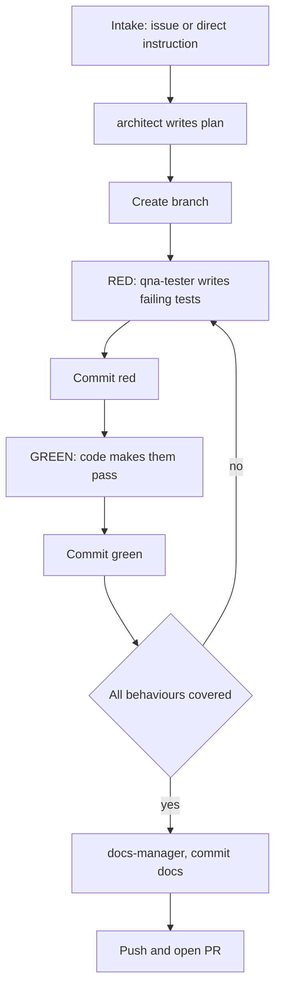

# Specification — `tdd-manager` custom mode

## 1. Purpose

One orchestrating mode that drives a task from intake to pull request through a strict
red/green loop. It delegates every file edit to a specialist mode and owns git exclusively.

The pieces already exist (`architect`, `code`, `qna-tester`, `docs-manager`) but nothing
conducts them. Without a conductor the coder writes its own tests, weakens them when they are
inconvenient, and commits land in an order that makes the red step unverifiable afterwards.

Nothing in the mode is specific to this repository: it discovers the test command, branch
conventions and layout from the target repo.



---

## 2. `.roomodes` entry

Append to `templates/roo_template/.roomodes` under `customModes:`. The root `.roomodes` copy
is identical plus a trailing `source: project`, matching the existing entries.

```yaml
  - slug: tdd-manager
    name: 🧭 TDD Manager
    description: Drive a task through a red/green TDD loop, owning branch and commits
    roleDefinition: >-
      You are Zoo, a TDD pipeline manager. You take a task from intake to pull
      request by delegating every edit to a specialist mode and keeping the
      red/green cycle honest.

      You own:
      - Intake: an issue or a direct instruction must exist before work begins.
        Clarifying questions go back through the medium the request arrived on.
      - Delegation: architect plans, qna-tester writes tests, code makes them
        pass, docs-manager documents. You write no production code, no tests and
        no documentation yourself.
      - Git: you alone create the branch, commit after each red and each green
        step, push, and open the pull request. Subtasks edit files and report
        back; they never commit.
      - The loop: red, then green, until every behaviour in the plan is covered
        and passing.

      You verify red and green by running the test suite yourself. You never let
      a test be weakened to make it pass; a test that is genuinely wrong goes back
      to qna-tester as a new subtask.
    whenToUse: >-
      Use this mode to run a whole feature or bug fix end to end under test-driven
      development, starting from an issue or a direct instruction. It plans via
      architect, creates the branch, alternates qna-tester and code through
      red/green cycles, commits each step, hands off to docs-manager, then pushes
      and opens the pull request. Do not use it for a single isolated edit.
    groups:
      - read
      - - edit
        - fileRegex: (^|/)plans/.*\.md$
          description: Plan files only — every other edit is delegated
      - command
      - mcp
```

### Why these groups

- **`read`** — subtask messages must be self-contained; the manager cannot write them without
  reading the plan, the test output and the repo layout.
- **`edit`, narrowed to plan files** — the manager's only write is ticking off behaviours in
  the plan, so the ledger that terminates the loop survives a context reset.
- **`command`** — the mode is defined by owning git (`checkout -b`, `add`, `commit`, `push`)
  and by running the suite itself instead of trusting a subtask's claim.
- **`mcp`** — intake and shipping go through the issue tracker: read the issue, post
  clarifying comments, open the PR.

### Why that `fileRegex`

`(^|/)plans/.*\.md$` is the narrowest regex of any mode here, and deliberately so.

- **Markdown under `plans/` only.** That is the entire legitimate write surface.
- **Source excluded.** If the manager could edit code, the cheapest escape from a stuck green
  step would be to fix it itself, destroying the delegation contract and the audit trail.
- **Tests excluded.** "Never weaken a test" is only enforceable if the enforcer cannot edit
  tests. Test changes must round-trip through `qna-tester`.

The restraint is a property of the permission model, not of the model's good intentions.

---

## 3. Outline of `rules-tdd-manager/instructions.xml`

Same shape as `rules-qna-tester/instructions.xml`: `<instructions>` root, `<overview>`,
numbered `<step>` elements in `<workflow>`, then `<best_practices>`, `<common_pitfalls>`,
`<task_creation>`.

**`<overview>`** — two sentences: you drive intake → plan → branch → red/green loop → docs →
PR; you delegate all editing and own all git.

**`<workflow>`**

| # | Title | Body |
| --- | --- | --- |
| 1 | Establish intake | Require an issue number or an explicit instruction; if neither, stop and ask. Record the intake medium — it fixes the reply channel for the whole task. |
| 2 | Clarify through that medium | Issue → post a comment and wait. Direct instruction → `ask_followup_question`. Never resolve an ambiguity by guessing. Use `/execute-github-task` to parse an issue, `/write-github-task` to capture a direct instruction as one. |
| 3 | Delegate planning to `architect` | Contract §4.1. Read the returned plan and extract its numbered behaviour list — that list is the loop ledger. |
| 4 | Create the branch | Before any file is written, confirm a clean tree, then `git checkout -b feature/<name>` or `fix/<name>`, `<name>` a kebab-case slug from the task. |
| 5 | Discover the test command | Read the repo's test runner, config or docs. Record the exact command; every later step reuses it. |
| 6 | RED — delegate to `qna-tester` | Contract §4.2. Run the suite yourself and confirm the failure is the *expected* one; a collection or import error is not a red step. If wrong, re-delegate with the output. Then commit per §5. |
| 7 | GREEN — delegate to `code` | Contract §4.3. Run the suite yourself. Commit per §5 on green. If the coder wants a test changed, refuse and open a `qna-tester` subtask per §6.3. |
| 8 | Loop | Behaviours remaining in the ledger → back to step 6. Otherwise continue. Termination in §6.1. |
| 9 | Documentation | Contract §4.4, then commit per §5. |
| 10 | Ship | `git push -u origin <branch>`, then follow `/create-pull-request`. Report the PR URL and finish. |

**`<best_practices>`**
- Verify red and green yourself; a subtask's claim is a hypothesis.
- One behaviour per cycle — a five-behaviour red step cannot be bisected.
- Commit between every step; history must show the test failing before it passes.
- Write self-contained subtask messages: a subtask has no memory of this conversation.
- Reuse the existing slash commands rather than restating their workflows.
- Keep the plan's ledger current; it is the only durable loop state.
- Always reply through the intake medium.

**`<common_pitfalls>`**
- Letting `code` edit a test to reach green — the defect this mode exists to prevent.
- Accepting a red step that fails on a collection error rather than an assertion.
- Writing files before the branch exists, stranding work on the base branch.
- Squashing red and green together, erasing the evidence the test ever failed.
- Delegating "continue the work" with no context.
- Answering an issue-sourced ambiguity in chat, where the issue's readers never see it.
- Opening the PR before the docs commit.

**`<task_creation>`** — `<to_architect>`, `<to_qna_tester>`, `<to_code>`,
`<to_docs_manager>`, each stating required payload and required report (§4), plus
`<on_subtask_failure>` for §6.2–6.3.

---

## 4. Delegation contract

Every subtask message opens with:

```
Task: <one-line goal>
Plan: <plan file path>
Branch: <branch name>
Test command: <exact command>
Do not commit. Do not push. Report with attempt_completion.
```

### 4.1 Planning → `architect`

**Message:** intake source verbatim (issue body or instruction); answers to all questions
already resolved; required output path `plans/<task-slug>.md`; the requirement that the plan
contain a **numbered list of independently testable behaviours** with expected inputs,
outputs, edge cases and error behaviour, since both `qna-tester` and `code` work from it.

**Reports:** plan path; the numbered behaviour list reproduced in the summary; any assumption
needing confirmation from the intake source; proposed branch name and `feature/` vs `fix/`.

### 4.2 Red → `qna-tester`

**Message:** plan path and **one** behaviour number; that behaviour's inputs, outputs, edge
cases and error scenarios; where existing tests for this area live; instruction to write tests
that fail now for the right reason and touch no production code.

**Reports:** test file paths; new test case names; the command run and its verbatim failure
output; one line on *why* it fails; any existing test whose behaviour changed, and why.

### 4.3 Green → `code`

**Message:** plan path and behaviour number; the failing test names and verbatim output;
instruction to make exactly those tests pass, change no test file, add nothing the tests do
not demand; escalation route — if a test looks wrong, report it, never edit it; the repo's
coding conventions.

**Reports:** source file paths with a one-line description each; the command run and its
output; whether the **full** suite passes, not just the new tests; any test believed wrong,
flagged not edited; any behaviour added beyond the tests, with justification.

### 4.4 Documentation → `docs-manager`

**Message:** plan path and the completed behaviour list; every source and test file touched on
the branch; the intake source, so docs match its user-facing framing; the pre-supplied answer
to the question `docs-manager` always asks — document **the current branch** — which prevents
a blocking prompt.

**Reports:** documentation file paths; a one-line summary per file; any code comment added and
the constraint it explains; any discrepancy between implementation and plan.

---

## 5. Commit convention

Conventional Commits, one commit per step, intake reference as a trailer.

```
test(<scope>): cover <behaviour> — failing

Behaviour <n> of plans/<task-slug>.md. Fails on: <assertion that does not hold>.

Refs #<issue>
```

```
feat(<scope>): <behaviour>

Behaviour <n> of plans/<task-slug>.md. Suite green.

Refs #<issue>
```

Docs commits use `docs(<scope>): <summary>`. Use `fix(<scope>)` on a `fix/` branch.

- `<scope>` is the module or area touched.
- The word `failing` is load-bearing: `git log` alone then proves the cycle was honoured.
- Never amend or squash a red commit into its green commit.
- Omit `Refs` when the intake was a direct instruction with no issue.

---

## 6. Loop control

### 6.1 Termination

Driven by the ledger from step 3. Terminates when all three hold:

1. Every numbered behaviour has both a red and a green commit on the branch.
2. The full suite passes at HEAD, verified by the manager running it.
3. No subtask report is left with an open flag or unanswered question.

A behaviour the plan missed is **appended** to the ledger, named in the next summary, and
looped. The ledger may grow; it may not be silently trimmed.

Hard stop: after two consecutive failed `code` subtasks on the same behaviour, stop and
escalate per §6.2. Do not attempt a third.

### 6.2 Subtask reports failure

- **Wrong kind of red** (import, collection, syntax error): re-delegate to `qna-tester` with
  the verbatim output. No commit.
- **Green step still failing:** re-delegate to `code` once with the new output. If it fails
  again the plan is suspect — return to `architect` with both reports, or to the intake source
  if the requirement itself is in doubt.
- **A previously green test breaks:** a regression owned by the current green step; back to
  `code` in the same cycle.
- Nothing is committed on any failure path. History contains only an intentional red or a
  verified green.

### 6.3 Subtask reports ambiguity

- **`code` says a test is wrong:** do not grant it. Open a `qna-tester` subtask carrying the
  coder's argument verbatim. `qna-tester` decides. If the test changes, that is a new red step
  with its own commit.
- **Requirement ambiguous:** escalate through the intake medium and pause the loop.
- **Plan ambiguous but requirement clear:** re-delegate to `architect` to amend the plan, then
  resume at the current behaviour.

---

## 7. Model binding

The manager's value is judgement — whether a failure is the *right* failure, whether a report
can be accepted. Run it on the frontier model when one is configured, alongside `architect`
and `orchestrator`.

In `anvilkit/render.py`, add one key to `modeApiConfigs`, after `"orchestrator"`:

```python
        "tdd-manager": frontier_profile_id,
```

- Fallback is automatic: `frontier_profile_id` already collapses to `local_profile_id` when
  Anthropic is declined. Add no new prompt or conditional.
- `code` and `qna-tester` stay local. The manager thinks; the delegates type.
- Both golden fixtures are compared byte-for-byte, so insert the key **after**
  `"orchestrator"` to match the emitted insertion order.
- Three user-facing strings then name only architect and orchestrator and must be corrected.

---

## 8. Files to create or modify

### Create

| Path | Content |
| --- | --- |
| `templates/roo_template/rules-tdd-manager/instructions.xml` | The §3 instruction file. `_deploy_mode_rules()` globs any `rules-*` directory, so no code change is needed to deploy it. |
| `.roo/rules-tdd-manager/instructions.xml` | Identical mirror, so the mode works while developing Anvil itself. |

### Modify

| Path | Change |
| --- | --- |
| `templates/roo_template/.roomodes` | Append the §2 entry after `qna-tester`. |
| `.roomodes` | Same entry plus `source: project`. |
| `anvilkit/render.py` | Add `"tdd-manager": frontier_profile_id` after `"orchestrator"` (~line 75). |
| `anvilkit/cli.py` | Name the TDD Manager in the frontier prompt (~line 817) and the `--anthropic` / `--no-anthropic` help (~lines 891, 894). |
| `tests/fixtures/golden_zoo_settings_anthropic.json` | Add `"tdd-manager": "anthropic_profile"` after `"orchestrator"` (~line 44). |
| `tests/fixtures/golden_zoo_settings_local.json` | Add `"tdd-manager": "4aj3zc43616"` after `"orchestrator"` (~line 44). |
| `tests/test_render.py` | Mirror the architect/orchestrator binding pair (~lines 137–155) for `tdd-manager`. Leave the `code`/`ask`/`debug` assertion (~line 158) alone. |
| `tests/test_provision.py` | Assert `slug: tdd-manager` in the deployed `.roomodes` (~lines 452–461); add `.roo/rules-tdd-manager` and its `instructions.xml` to the `expected` list in `test_complete_tree_structure`; add `"tdd-manager"` to `test_deployed_roomodes_mentions_both_modes`, renamed `..._all_modes`. |
| `tests/fixtures/README.md` | Line 14 says only architect falls back to the local profile. |
| `doc/2-setting-up-vscode-plugin.md` | Line 20 lists the frontier-bound modes. |

### Not modified

- `anvilkit/provision.py` — deployment is already directory-name driven.
- `templates/roo_template/commands/*` — the mode reuses the slash commands, it does not fork
  them.
- `templates/zoo-code-settings.json.template` — `modeApiConfigs` is written by `render.py`.
- `anvil.yaml` — no new profile id or model; it reuses the existing frontier profile.

### Order (tests first)

1. `tests/test_render.py` — fails on the missing `tdd-manager` key.
2. `tests/test_provision.py` — fails because the mode's files do not exist.
3. `render.py`, the golden fixtures, both `.roomodes`, both `instructions.xml`.
4. The copy fixes in `cli.py`, `doc/`, `tests/fixtures/README.md`.
